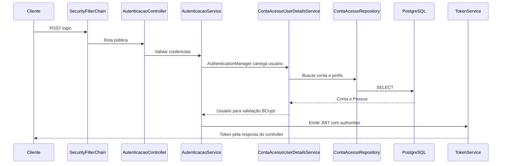
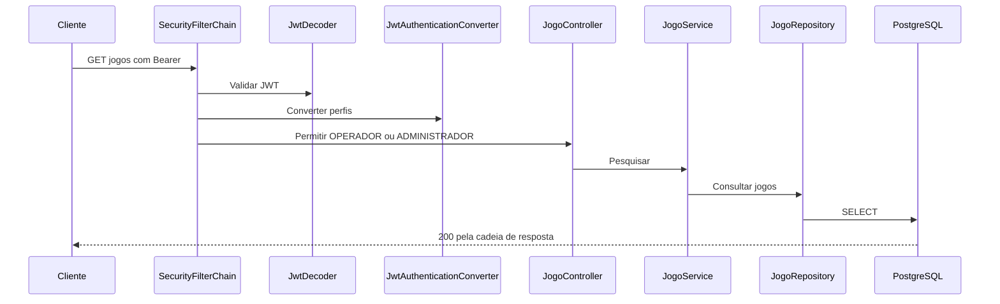
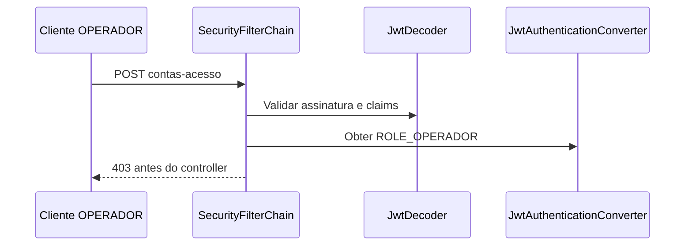
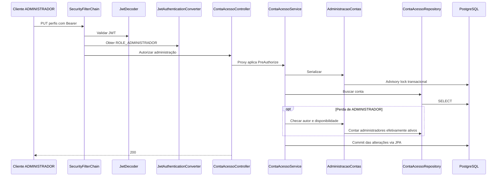
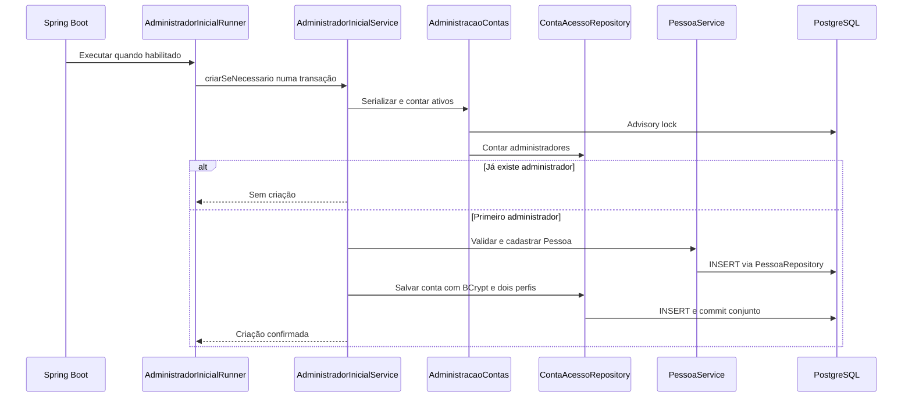

# Aula 14 — Diagramas

## Login

```mermaid
sequenceDiagram
    participant C as Cliente
    participant F as SecurityFilterChain
    participant A as AutenticacaoController
    participant S as AutenticacaoService
    participant U as ContaAcessoUserDetailsService
    participant R as ContaAcessoRepository
    participant P as PostgreSQL
    participant T as TokenService
    C->>F: POST login
    F->>A: Rota pública
    A->>S: Validar credenciais
    S->>U: AuthenticationManager carrega usuário
    U->>R: Buscar conta e perfis
    R->>P: SELECT
    P-->>U: Conta e Pessoa
    U-->>S: Usuário para validação BCrypt
    S->>T: Emitir JWT com authorities
    T-->>C: Token pela resposta do controller
```

## Consulta cotidiana

```mermaid
sequenceDiagram
    participant C as Cliente
    participant F as SecurityFilterChain
    participant D as JwtDecoder
    participant J as JwtAuthenticationConverter
    participant A as JogoController
    participant S as JogoService
    participant R as JogoRepository
    participant P as PostgreSQL
    C->>F: GET jogos com Bearer
    F->>D: Validar JWT
    F->>J: Converter perfis
    F->>A: Permitir OPERADOR ou ADMINISTRADOR
    A->>S: Pesquisar
    S->>R: Consultar jogos
    R->>P: SELECT
    P-->>C: 200 pela cadeia de resposta
```

## Operador sem privilégio

```mermaid
sequenceDiagram
    participant C as Cliente OPERADOR
    participant F as SecurityFilterChain
    participant D as JwtDecoder
    participant J as JwtAuthenticationConverter
    C->>F: POST contas-acesso
    F->>D: Validar assinatura e claims
    F->>J: Obter ROLE_OPERADOR
    F-->>C: 403 antes do controller
```

## Administração de perfis

```mermaid
sequenceDiagram
    participant C as Cliente ADMINISTRADOR
    participant F as SecurityFilterChain
    participant D as JwtDecoder
    participant J as JwtAuthenticationConverter
    participant A as ContaAcessoController
    participant S as ContaAcessoService
    participant G as AdministracaoContas
    participant R as ContaAcessoRepository
    participant P as PostgreSQL
    C->>F: PUT perfis com Bearer
    F->>D: Validar JWT
    F->>J: Obter ROLE_ADMINISTRADOR
    F->>A: Autorizar administração
    A->>S: Proxy aplica PreAuthorize
    S->>G: Serializar
    G->>P: Advisory lock transacional
    S->>R: Buscar conta
    R->>P: SELECT
    opt Perda de ADMINISTRADOR
        S->>G: Checar autor e disponibilidade
        G->>R: Contar administradores efetivamente ativos
    end
    S->>P: Commit das alterações via JPA
    A-->>C: 200
```

## Provisionamento inicial

```mermaid
sequenceDiagram
    participant B as Spring Boot
    participant R as AdministradorInicialRunner
    participant S as AdministradorInicialService
    participant G as AdministracaoContas
    participant C as ContaAcessoRepository
    participant A as PessoaService
    participant P as PostgreSQL
    B->>R: Executar quando habilitado
    R->>S: criarSeNecessario numa transação
    S->>G: Serializar e contar ativos
    G->>P: Advisory lock
    G->>C: Contar administradores
    alt Já existe administrador
        S-->>R: Sem criação
    else Primeiro administrador
        S->>A: Validar e cadastrar Pessoa
        A->>P: INSERT via PessoaRepository
        S->>C: Salvar conta com BCrypt e dois perfis
        C->>P: INSERT e commit conjunto
        S-->>R: Criação confirmada
    end
```
